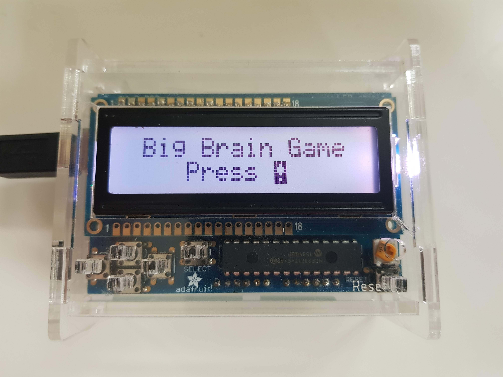
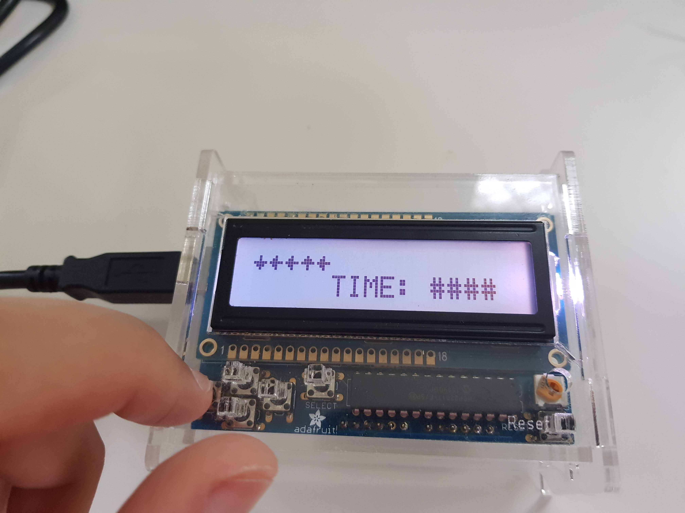

# Big Brain Game
This is a memory game I've made for the Arduino Uno and Adafruit 16x2 LCD Shield Kit.
It features a "Free Play" infinite mode and a "Story Mode" which progressively gets more difficult.

## Pictures

## Requirements
- Arduino Uno
- Adafruit 16x2 RGB LCD Shield display

## Dependencies
| Library                         | Version |
|---------------------------------|---------|
| Adafruit Circuit Playground     | 1.10.4  |
| Adafruit RGB LCD Shield Library | 1.03    |
